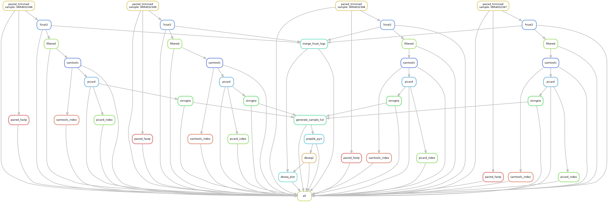

# Quick Start

## Step1: deploy workflow

* First,make sure that you have activated APIARC,if not 

        conda activate APIARC

* Then ,switch to the directory 

        cd RNAProj

## Step2: prepare for inputfile
We support compressed and uncompressed fastq formats for single-end and paired-end samples.You are supposed to put these samples in directory RNAProj/fastqfile.

## Step3: configure workflow
* To configure this workflow, modify config/config.yaml according to your needs, following the explanations provided below

* conda_install_path: /home/yxiaobo/miniconda3

    Directory path to your conda.sh file,like this {conda_install_path}/etc/profile.d/conda.sh
* genome
    * `indexdir`
    
        Directory path for decompressed reference file of gene index(hisat2)
    * `gfffile`
        
        Directory path for decompressed reference file of gene annotation(stringtie)

* threads
    * `trim_galore`

        The number of threads for rule paired_trimmed,paired_trimmed_gz,single_trimmed and single_trimmed_gz
    * `fastp`

        The number of threads for rule paired_fastp and single_fastp
    * `hisat2`

        The number of threads for rule hisat2
    * `samtools`

        The number of threads for rule samtools
    * `stringtie`
        The number of threads for rule stringtie

* picard
    * `java_mem`

        The maximum heap memory size that the JVM can use
    * `remove_dups`

        Control whether the picard MarkDuplicates tool removes marked duplicate reads
    * `picarddir`

        Specify the installation directory path of the picard tool

* names
    
    Choose appropriate names for your samples that corresponds to them, based on the samples' characteristics or your preferences .In a form similar to the following.

        mmESC_24h_DOX_1: SRR4032346
        mmESC_24h_DOX_2: SRR4032347
        mmESC_no_DOX_1: SRR4032348
        mmESC_no_DOX_2: SRR4032349

* group
    
    * `sample_IDs`

        Classify your samples into the experimental group P and the control group T according to the actual situation of the samples you selected, and match them with the corresponding names. Note that the names must be consistent with those in the "names" from the previous step .In a form similar to the following.

            mmESC_24h_DOX_1: P 
            mmESC_24h_DOX_2: P
            mmESC_no_DOX_1: T
            mmESC_no_DOX_2: T
    
## Step4: run workflow
1.dry run test

    snakemake -np
2.actual run

    nohup snakemake --cores x > log_rna.txt 2>&1 &

or

    snakemake --cores x > log_rna.txt 2>&1 

Note that you need to replace x with a specific number, and the log file "log_rna.txt" can be modified according to your preference.And the first command in actual run is recommended.

## Demo
### config/config.yaml

#你的conda.sh路径{conda_install_path}/etc/profile.d/conda.sh
        conda_install_path: /home/yxiaobo/miniconda3

#参考基因组
genome:
  indexdir: "/home/public_software_annotation/genomeanno/mousehisat2Index/GRCm38"          ##hisat2 参考基因组，可自行修改对应路径
  gfffile: "/home/public_software_annotation/genomeanno/gencode.vM25.mRNA.annotation.gtf"  ##stringtie 参考注释文件路径，可自行修改对应路径

#线程数
threads:
  trim_galore: 4  ##质控，可根据实际情况修改数量
  fastp: 5        ##进一步质控
  hisat2: 4       ##比对
  samtools: 4     ##转换排序
  stringtie: 5    ##转录本组装

#  去重参数
picard:
  java_mem: "-Xmx15g"  ## JVM 最大堆内存设置为15GB,可根据实际情况修改
  remove_dups: "true"  ## 是否删除重复 reads，"true"/"false",推荐为"true"，可根据实际情况修改
  picarddir: "/home/public_software_annotation/software/picard-2.18.2"  ## Picard 路径，可根据实际情况修改

#生成列表文件
names:
  mmESC_24h_DOX_1: SRR4032346  ##对应的组别名称(如mmESC_24h_DOX_1)和样本SRR号（SRR4032346 ）可根据实际需求对应修改和增减
  mmESC_24h_DOX_2: SRR4032347
  mmESC_no_DOX_1: SRR4032348
  mmESC_no_DOX_2: SRR4032349

#分组
group:
  sample_IDs:     
    mmESC_24h_DOX_1: P   ##对应的组别名称和上面names的要一致，且P代表实验组，T代表对照组
    mmESC_24h_DOX_2: P
    mmESC_no_DOX_1: T  
    mmESC_no_DOX_2: T

### input
* `fastqfile`
        
        SRR4032346_1.fastq
        SRR4032346_2.fastq
        SRR4032347_1.fastq
        SRR4032347_2.fastq
        SRR4032348_1.fastq
        SRR4032348_2.fastq
        SRR4032349_1.fastq
        SRR4032349_2.fastq

### output
* logs

    `hisat2_summary.log`

        ===== SRR4032346 =====
        28712710 reads; of these:
            28712710 (100.00%) were paired; of these:
                1853791 (6.46%) aligned concordantly 0 times
                20162146 (70.22%) aligned concordantly exactly 1 time
                6696773 (23.32%) aligned concordantly >1 times

* DEG

    `gene_count_matrix.csv`

        gene_id	mmESC_24h_DOX_1	mmESC_24h_DOX_2	mmESC_no_DOX_1  mmESC_no_DOX_2
        ENSMUSG00000025902.13|Sox17	58	25	10	16
        ENSMUSG00000051951.5|Xkr4	10	27	6	0
        ENSMUSG00000025900.13|Rp1	9	15	0	0

    `result.csv`

        SYMBOL	baseMean	log2FoldChange	lfcSE	stat	pvalue	padj	mmESC_24h_DOX_1	mmESC_24h_DOX_2	mmESC_no_DOX_1	mmESC_no_DOX_2	gene_id
        Sox17	32.271398399619	2.42723223	0.834071570798238	2.91010066140013	0.00361312366375131	0.00931619665455771	79.3345521545681	29.5793824458375	8.05247114966186	12.1191878484085	ENSMUSG00000025902.13
        Xkr4	12.6138966981085	3.25383101810468	1.48723396890127	2.1878407070735	0.0286812075466679	0.0602163526432093	13.6783710611324	31.9457330415045	4.83148268979711	0	ENSMUSG00000051951.5
        Rp1	7.51454085563042	6.71026497246281	2.14049976018079	3.134905734	0.00171909342944577	0.00473560046310533	12.3105339550192	17.7476294675025	0	0	ENSMUSG00000025900.13

    `UP_gene_names.bed`

        chrX	161082525	161258213	ENSMUSG00000000037.17	Scml2
        chr11	85832551	85841948	ENSMUSG00000000093.6	Tbx2
        chr11	59306928	59333552	ENSMUSG00000000126.11	Wnt9a
        chr11	108920349	108950783	ENSMUSG00000000142.15	Axin2

    `DOWN_genes_name.bed`   

        chr7	143005046	143019644	ENSMUSG00000000244.17	Tspan32
        chr11	70241457	70255353	ENSMUSG00000000320.10	Alox12
        chrX	166523007	166585720	ENSMUSG00000000402.2	Egfl6
        chr7	127214447	127233130	ENSMUSG00000000486.13	Septin1
 

 ### All outfiles    

| File Name          | Position          | Meaning          | Workflow          | Tool          |  Link         |			|        
|:-----          |:-----           |:-----           |:-----           |:-----           |:------       |:-----			|			            
|sample_1_val_1.fq.gz(paired)           |QCfile           |-           |RNAProj/CHIPProj           |trim_galore           |https://www.bioinformatics.babraham.ac.uk/projects/trim_galore/            |
|sample_2_val_2.fq.gz(paired)           |QCfile           |-           |RNAProj/CHIPProj           |trim_galore           |https://www.bioinformatics.babraham.ac.uk/projects/trim_galore/            |
|sample_1_val_1_fastqc.html(paired)           |QCfile           |-           |RNAProj/CHIPProj           |trim_galore           |https://www.bioinformatics.babraham.ac.uk/projects/trim_galore/	|
|sample_2_val_2_fastqc.html(paired)           |QCfile           |-           |RNAProj/CHIPProj           |trim_galore           |https://www.bioinformatics.babraham.ac.uk/projects/trim_galore/	|
|sample_1_val_1_fastqc.zip(paired)           |QCfile           |-           |RNAProj/CHIPProj           |trim_galore           |https://www.bioinformatics.babraham.ac.uk/projects/trim_galore/	|
|sample_2_val_2_fastqc.zip(paired)           |QCfile           |-           |RNAProj/CHIPProj           |trim_galore           |https://www.bioinformatics.babraham.ac.uk/projects/trim_galore/	|
|sample_1.fastq_trimming_report.txt(paired)           |QCfile           |-           |RNAProj/CHIPProj           |trim_galore           |https://www.bioinformatics.babraham.ac.uk/projects/trim_galore/	|
|sample_2.fastq_trimming_report.txt(paired)           |QCfile           |-           |RNAProj/CHIPProj           |trim_galore           |https://www.bioinformatics.babraham.ac.uk/projects/trim_galore/	|
|sample_1_trimmed.fq.gz(single)           |QCfile           |-           |RNAProj/CHIPProj          |trim_galore           |https://www.bioinformatics.babraham.ac.uk/projects/trim_galore/	|
|sample_1_trimmed_fastqc.html(single)           |QCfile           |-           |RNAProj/CHIPProj           |trim_galore           |https://www.bioinformatics.babraham.ac.uk/projects/trim_galore/	|
|sample_1_trimmed_fastqc.zip(single)           |QCfile           |-           |RNAProj/CHIPProj           |trim_galore           |https://www.bioinformatics.babraham.ac.uk/projects/trim_galore/	|
|sample_1.fastq_trimming_report.txt(single)           |QCfile           |-           |RNAProj/CHIPProj           |trim_galore           |https://www.bioinformatics.babraham.ac.uk/projects/trim_galore/	|
|sample_clean_1.fq.gz(paired)           |QCfile/fastp/paired  |    -       |  RNAProj         | fastp          |https://github.com/OpenGene/fastp	|
|sample_clean_2.fq.gz(paired)           |QCfile/fastp/paired  |      -    |     RNAProj      |fstap           |	https://github.com/OpenGene/fastp|
|sample.json(paired)           |QCfile/fastp/paired  |  -         |      RNAProj     | fstap          |	https://github.com/OpenGene/fastp|
|sample.html(paired)           |QCfile/fastp/paired  |   -        |     RNAProj      |  fastp         |https://github.com/OpenGene/fastp	|
|sample_clean.fq.gz(single)           |QCfile/fastp/single  |    -       |  RNAProj         | fastp          |https://github.com/OpenGene/fastp	|
|sample.json(single)           |QCfile/fastp/single  |  -         |      RNAProj     | fstap          |	https://github.com/OpenGene/fastp|
|sample.html(single)           |QCfile/fastp/single  |   -        |     RNAProj      |  fastp         |https://github.com/OpenGene/fastp	|
|sample.sam           | mapping          |   -        |  RNAProj         |  hisat2         |http://daehwankimlab.github.io/hisat2/	|
|hisat2_summary.log           |    mapping       | It contains the alignment logs of each sample generated by HISAT2.          |     RNAProj      |       -    |-	|
| sample_filtered.sam          |  mapping         |    It contains filtered SAM files.       |    RNAProj       |       -   |	-|
|sample_sorted.bam           |    mapping       |  -         |    RNAProj       |  samtools         |https://www.htslib.org	|
|sample_sorted.bam.bai           |   mapping        |   -        |      RNAProj     |    samtools       |https://www.htslib.org	|
|sample.dedup.bam           |mapping           |     -      |     RNAProj      |   picard        |	https://broadinstitute.github.io/picard/|
|sample.metricsFile           |  mapping         |     -      |     RNAProj      |    picard       |	https://broadinstitute.github.io/picard/|
|sample.dedup.bam.bai           |  mapping         |  -         |    RNAProj       |   samtools        |https://www.htslib.org	|
|sample.transcripts.gtf           |   expression        |      -     |    RNAProj       |   stringtie        |	https://ccb.jhu.edu/software/stringtie/|
|sample.gene_abundance.txt           |   expression        |     -      |   RNAProj        |  stringtie         |	https://ccb.jhu.edu/software/stringtie/|
|sample_list.txt           |   expression        |     It contains the paths of each GTF fileS and their corresponding names( you refer to in the Config.)      |     RNAProj      |      -     |	-|
|transcript_count_matrix.csv           |   DEG        | The original count matrix at the transcript level.          |    RNAProj       |      -     |	-|
|gene_count_matrix.csv           |     DEG      |  The original count matrix at the gene level.         |    RNAProj      |  -        |	-|
|result.csv           |  DEG         |   Statistical comparison results of all genes among different samples    |    RNAProj      | -          |	-|
|UP_gene_names.bed           |   DEG        | Genomic coordinate information of up-regulated genes     |   RNAProj       | -         |	-|
| UP_genes_name.csv          |DEG           |  List of significantly up-regulated genes      |  RNAProj        |   -        |	-|
|DOWN_gene_names.bed           |  DEG         |Genomic coordinate information of down-regulated genes        |    RNAProj       |      -     |	-|
| DOWN_gene_names.csv          |DEG          |List of significantly down-regulated genes        | RNAProj          |    -       |	-|
|hista2_result.pdf           |     picture      |   Hista2的比对结果（多次比较）      |  RNAProj           |        -   |	-|
| mRNA_volcano.pdf          | picture          |    mRNA的表达量差异分析结果的火山图      |      RNAProj       |  -         |	-|
| sample_boxplot.pdf          |   picture        |    展示样本差异的箱型图      |     RNAProj        |   -        |	-|
|sample_dist_heatmap.pdf           |  picture         |    展示样本差异的距离热图      | RNAProj            |    -       |	-|
| sample_PCA.pdf          |  picture         |   样本经PCA降维的结果      |  RNAProj           | -            |	-|
|           |           |           |           |           |	|

All required reference files are prepared in the [reference](/reference/readme.md).

    

