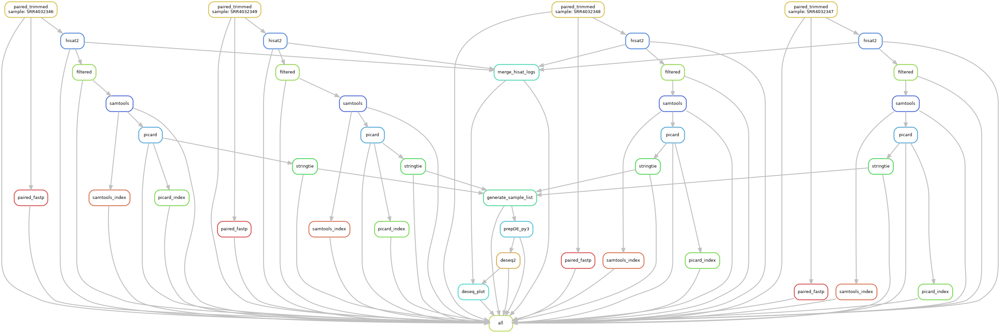

# RNA-seq Analysis Pipeline



## Quick Start Guide

### 1. Workflow Deployment

1. **Navigate to the RNAProj directory:**
   ```bash
   cd RNAProj
   ```

---

### 2. Input File Preparation

- **Supported formats:**
  - Compressed (`.fastq.gz`) or uncompressed (`.fastq`) FASTQ files
  - Both single-end and paired-end sequencing data
- **Directory structure:**
  Place all input files in:
  ```
  RNAProj/fastqfile/
  ```

---

### 3. Workflow Configuration

Modify parameters in `workflow/config.yaml` as follows:

#### System Configuration
- **`conda_install_path`**:
  Path to your Conda installation (e.g., `/home/user/miniconda3`)

#### Reference Genome
- **`indexdir`**:
  Directory containing HISAT2 genome indices
- **`gfffile`**:
  Path to gene annotation file (GTF format) for StringTie

#### Computational Resources
- **Thread allocation:**
  ```yaml
  threads:
    trim_galore: 4    # Quality control
    hisat2: 4         # Alignment
    samtools: 4       # SAM/BAM processing
    stringtie: 5      # Transcript assembly
  ```

#### Picard Parameters
- **`java_mem`**:
  JVM maximum heap size (e.g., `-Xmx15g`)
- **`remove_dups`**:
  Set to `"true"` to remove duplicate reads
- **`picarddir`**:
  Path to Picard installation directory

#### Sample Metadata
- **Sample naming convention:**
  ```yaml
  names:
    mmESC_24h_DOX_1: SRR4032346
    mmESC_24h_DOX_2: SRR4032347
    mmESC_no_DOX_1: SRR4032348
    mmESC_no_DOX_2: SRR4032349
  ```
- **Experimental design:**
  ```yaml
  group:
    sample_IDs:
      mmESC_24h_DOX_1: P  # P = Treatment group
      mmESC_24h_DOX_2: P  # T = Control group
      mmESC_no_DOX_1: T   
      mmESC_no_DOX_2: T
  ```

---

### 4. Workflow Execution

1. **Test configuration (dry run):**
   ```bash
   snakemake -np
   ```
2. **Execute pipeline:**
   ```bash
   nohup snakemake --cores <N> > log_rna.txt 2>&1 &
   ```
   Where `<N>` = number of CPU cores to use

---

## Configuration Template

### `workflow/config.yaml`
```yaml
conda_install_path: /home/yxiaobo/miniconda3

genome:
  indexdir: "/home/public_software_annotation/genomeanno/mousehisat2Index/GRCm38"
  gfffile: "/home/public_software_annotation/genomeanno/gencode.vM25.mRNA.annotation.gtf"

threads:
  trim_galore: 4
  fastp: 5
  hisat2: 4
  samtools: 4
  stringtie: 5

picard:
  java_mem: "-Xmx15g"
  remove_dups: "true"
  picarddir: "/home/public_software_annotation/software/picard-2.18.2"

names:
  mmESC_24h_DOX_1: SRR4032346
  mmESC_24h_DOX_2: SRR4032347
  mmESC_no_DOX_1: SRR4032348
  mmESC_no_DOX_2: SRR4032349

group:
  sample_IDs:
    mmESC_24h_DOX_1: P
    mmESC_24h_DOX_2: P
    mmESC_no_DOX_1: T
    mmESC_no_DOX_2: T
```

---

## Input/Output Specifications

### Input Files
Example paired-end input structure:
```
fastqfile/
├── SRR4032346_1.fastq
├── SRR4032346_2.fastq
├── SRR4032347_1.fastq
├── SRR4032347_2.fastq
├── SRR4032348_1.fastq
├── SRR4032348_2.fastq
├── SRR4032349_1.fastq
└── SRR4032349_2.fastq
```

### Key Output Files

#### Alignment Metrics
- **`hisat2_summary.log`**:
```
29276826 reads; of these:
  29276826 (100.00%) were paired; of these:
    1566828 (5.35%) aligned concordantly 0 times
    24938684 (85.18%) aligned concordantly exactly 1 time
    2771314 (9.47%) aligned concordantly >1 times
```

#### Differential Expression Results
- **`gene_count_matrix.csv`**:
```
gene_id,mmESC_24h_DOX_1,mmESC_24h_DOX_2,mmESC_no_DOX_1,mmESC_no_DOX_2
ENSMUSG00000025902.13|Sox17,58,25,10,16
ENSMUSG00000051951.5|Xkr4,10,27,6,0
ENSMUSG00000025900.13|Rp1,9,15,0,0
```

- **`DEG_result.csv`**:
```
"SYMBOL","baseMean","log2FoldChange","lfcSE","stat","pvalue","padj","mmESC_24h_DOX_1","mmESC_24h_DOX_2","mmESC_no_DOX_1","mmESC_no_DOX_2","gene_id"
"Sox17",32.271398399619,2.427232229835,0.834071570798239,2.91010066140013,0.00361312366375135,0.0093161966545578,79.3345521545681,29.5793824458375,8.05247114966186,12.1191878484085,"ENSMUSG00000025902.13"
"Xkr4",12.6138966981085,3.25383101810468,1.48723396890127,2.1878407070735,0.0286812075466678,0.0602163526432092,13.6783710611324,31.9457330415045,4.83148268979711,0,"ENSMUSG00000051951.5"
```

#### Visualization Outputs
- **`mRNA_volcano.pdf`**: Volcano plot of differentially expressed genes
- **`sample_PCA.pdf`**: Principal Component Analysis plot

---

## Complete Output File Reference

The following table provides a comprehensive list of all output files generated by the pipeline:

| File Name | Directory | Description | Tool |
| :--- | :--- | :--- | :--- |
| `{sample}_1_val_1.fq.gz` (paired) | `QCfile` | Trimmed reads 1 | trim_galore |
| `{sample}_2_val_2.fq.gz` (paired) | `QCfile` | Trimmed reads 2 | trim_galore |
| `{sample}_1_val_1_fastqc.html` (paired) | `QCfile` | FastQC report 1 | trim_galore |
| `{sample}_2_val_2_fastqc.html` (paired) | `QCfile` | FastQC report 2 | trim_galore |
| `{sample}_1_val_1_fastqc.zip` (paired) | `QCfile` | FastQC data 1 | trim_galore |
| `{sample}_2_val_2_fastqc.zip` (paired) | `QCfile` | FastQC data 2 | trim_galore |
| `{sample}_1.fastq_trimming_report.txt` (paired) | `QCfile` | Trimming report 1 | trim_galore |
| `{sample}_2.fastq_trimming_report.txt` (paired) | `QCfile` | Trimming report 2 | trim_galore |
| `{sample}_1_trimmed.fq.gz` (single) | `QCfile` | Trimmed reads (SE) | trim_galore |
| `{sample}_1_trimmed_fastqc.html` (single) | `QCfile` | FastQC report (SE) | trim_galore |
| `{sample}_1_trimmed_fastqc.zip` (single) | `QCfile` | FastQC data (SE) | trim_galore |
| `{sample}_1.fastq_trimming_report.txt` (single) | `QCfile` | Trimming report (SE) | trim_galore |
| `{sample}.sam` | `mapping` | Alignment file (SAM) | hisat2 |
| `hisat2_summary.log` | `logs` | Alignment statistics log | - |
| `{sample}_filtered.sam` | `mapping` | Filtered SAM file | samtools |
| `{sample}_sorted.bam` | `mapping` | Sorted alignment file (BAM) | samtools |
| `{sample}_sorted.bam.bai` | `mapping` | BAM index file | samtools |
| `{sample}.dedup.bam` | `mapping` | Deduplicated BAM file | picard |
| `{sample}.metricsFile` | `mapping` | Picard metrics file | picard |
| `{sample}.dedup.bam.bai` | `mapping` | BAM index file | samtools |
| `{sample}.transcripts.gtf` | `expression` | Transcript assembly | stringtie |
| `{sample}.gene_abundance.txt` | `expression` | Gene abundance estimates | stringtie |
| `sample_list.txt` | `expression` | GTF file paths and sample names |- |
| `e_data.ctab` | `expression` | exon | stringtie |
| `i_data.ctabt` | `expression` | intron | stringtie |
| `t_data.ctab` | `expression` | transcript | stringtie |
| `e2t.ctab` | `expression` | Exon to Transcript | stringtie |
| `i2t.ctab` | `expression` |Intron to Transcript | stringtie |
| `transcript_count_matrix.csv` | `DEG` | Transcript-level count matrix| prepDEpy|
| `gene_count_matrix.csv` | `DEG` | Gene-level count matrix | prepDE.py |
| `DEG_result.csv` | `DEG` | Differential expression results | DESeq2 |
| `UP_gene_names.bed` | `DEG` | Up-regulated gene coordinates |RNAseq_DEseq |
| `UP_genes_name.csv` | `DEG` | Up-regulated gene list | RNAseq_DEseq |
| `DOWN_gene_names.bed` | `DEG` | Down-regulated gene coordinates | RNAseq_DEseq |
| `DOWN_gene_names.csv` | `DEG` | Down-regulated gene list |RNAseq_DEseq |
| `hista2_result.pdf` | `picture` | HISAT2 alignment results | DEseq_result_plot_pipline |
| `mRNA_volcano.pdf` | `picture` | Volcano plot of DEGs | ggplot2 |
| `sample_boxplot.pdf` | `picture` | Sample distribution boxplot | ggplot2 |
| `sample_dist_heatmap.pdf` | `picture` | Sample distance heatmap | pheatmap |
| `sample_PCA.pdf` | `picture` | PCA analysis results | ggplot2 |

---

## Tools Used in Pipeline

| Tool | Purpose | Documentation |
| :--- | :--- | :--- |
| **Trim Galore** | Quality control and adapter trimming | [Link](https://www.bioinformatics.babraham.ac.uk/projects/trim_galore/) |
| **fastp** | Advanced quality control | [Link](https://github.com/OpenGene/fastp) |
| **HISAT2** | Sequence alignment | [Link](http://daehwankimlab.github.io/hisat2/) |
| **Samtools** | SAM/BAM file processing | [Link](https://www.htslib.org) |
| **Picard** | Duplicate marking and removal | [Link](https://broadinstitute.github.io/picard/) |
| **StringTie** | Transcript assembly and quantification | [Link](https://ccb.jhu.edu/software/stringtie/) |
| **prepDE.py** | Count matrix generation | [Link](https://ccb.jhu.edu/software/stringtie/) |
| **DESeq2** | Differential expression analysis | [Link](https://bioconductor.org/packages/release/bioc/html/DESeq2.html) |
| **ggplot2** | Data visualization | [Link](https://ggplot2.tidyverse.org/) |
| **pheatmap** | Heatmap visualization | [Link](https://cran.r-project.org/web/packages/pheatmap/) |
| **RNAseq_DEseq** | Heatmap visualization | [Link](workflow/scripts/RNAseq_DEseq.R) |
| **DEseq_result_plot_pipline** | Heatmap visualization | [Link](workflow/scripts) |


---

## Reference Data
All required reference files are documented in the [reference](/reference/readme.md).

---
